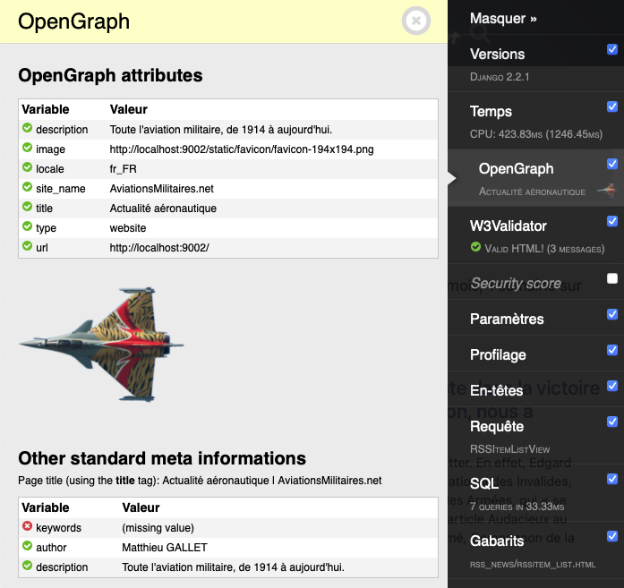

djt_og
======

Add a panel to [django-debug-toolbar](https://github.com/jazzband/django-debug-toolbar) that displays OpenGraph metadata found in your HTML page.



Just add "djt_og.panel.OpenGraphPanel" to your settings `DEBUG_TOOLBAR_PANELS`.

```python
# django-debug-toolbar
DEBUG_TOOLBAR_PANELS = [
    "debug_toolbar.panels.versions.VersionsPanel",
    "debug_toolbar.panels.timer.TimerPanel",
    "djt_og.panel.OpenGraphPanel",
    "debug_toolbar.panels.settings.SettingsPanel",
    "debug_toolbar.panels.profiling.ProfilingPanel",
    "debug_toolbar.panels.headers.HeadersPanel",
    "debug_toolbar.panels.request.RequestPanel",
    "debug_toolbar.panels.sql.SQLPanel",
    "debug_toolbar.panels.templates.TemplatesPanel",
    "debug_toolbar.panels.staticfiles.StaticFilesPanel",
    "debug_toolbar.panels.cache.CachePanel",
    "debug_toolbar.panels.signals.SignalsPanel",
    "debug_toolbar.panels.redirects.RedirectsPanel",
]
```


